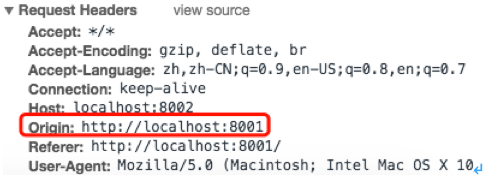
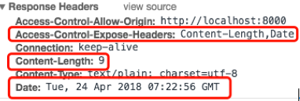
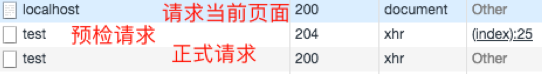
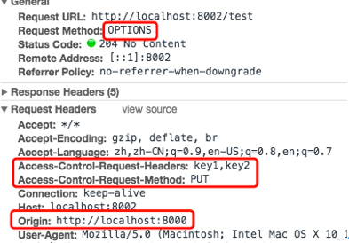
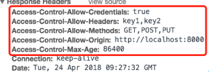

# CORS跨域

## 基础知识

### 什么是跨域

每个服务器都有1个唯一的域名，域名由以下几部分组成：

​           协议、域名、端口

​           如：http:www.baidu.com:80

当域名中存在任何一部分不同时，则认为是跨域

​           如：来自[www.baodu.com](http://www.baodu.com)的页面要请求[www.google.com](http://www.google.com)的资源，就是跨域

### 浏览器如何进行跨域限制

+ 跨域限制仅限于ajax请求

+ 默认情况下，浏览器从互联网上请求下来的js脚本，都会记住他来自哪个域名，当某个js脚本想要发送与他的来源不同域的请求时，浏览器会先判断这是1个简单请求还是非简单请求，如果这是1个简单请求，则会自动添加1个origin请求头直接发送出去；如果是非简单请求，则会自动添加一些请求头先预检一下服务器是否允许当前域的请求，如果服务器允许，则真正的将请求发出去，否则就报错（参见[CORS请求](#CORS请求)）

+ 举个🌰：

  现在浏览器上运行的js脚本是来自A网站的，但是该页面向B站发送了1个ajax请求，浏览器一看，你这是跨域了，就会先判断该请求是否属于简单请求，如果是，则自动添加origin请求头直接将请求发出，如果不是，则先发一个“预检”请求，如果浏览器回复允许你访问，则真正的发出请求，否则就不让发了

### 为什么要跨域

+ 有的时候同一个公司可能有好几个子域名，他们之间需要跨域互相访问资源

+ 当你的项目需要使用百度地图的api时，需要跨域让浏览器允许你的页面发送对百度地图所在的域名的请求

## CORS请求

+ 浏览器将CORS请求分成两类：简单请求（simple request）和非简单请求（not-so-simple request）
+ 只要同时满足以下两大条件，就属于简单请求
  + 请求方法是以下三种方法之一：
    + HEAD
    + GET
    + POST
  + HTTP的头信息不超出以下几种字段
    + Accept
    +  Accept-Language
    + Content-Language
    + Last-Event-ID
    + Content-Type：只限于三个值application/x-www-form-urlencoded、multipart/form-data、text/plain
+ 其他的都是非简单请求

### 简单请求

+ 简单请求请求头

  对于简单请求，浏览器自动添加1个`Origin`请求头，并将请求直接发出

  `Origin`：用于标识该跨域请求来自哪个域名

  例：`localhost:8001`中的`123.html`

  ```html
  <body>
      <div id="div1"></div>
  </body>
  </html>
  <script type="text/javascript">
      var url = 'http://localhost:8002';
      var xhr = new XMLHttpRequest();
      xhr.onreadystatechange = function(){
          if ((xhr.readyState == 4) && (xhr.status == 200)){
              document.getElementById('div1').innerHTML += xhr.responseText;
          }
      };
          xhr.onerror = function(){
          document.getElementById('div1').innerHTML += 'request error';
      };
      xhr.open('GET', url, true);
      xhr.send(null);
  </script>
  ```

  刷新123.html页面就会发出cors请求，在控制台看到请求头如下：

   

+ 简单请求响应头

  + Access-Control-Allow-Origin

    服务器接收到请求后，根据请求头中`Origin`字段值判断是否同意这次请求。

    + 如果服务端返回`Access-Control-Allow-Origin`头，并且该头的值包含请求中`Origin`指定的域名，则浏览器认为服务端允许这次跨域请求
    + 如果服务端没有返回`Access-Control-Allow-Origin`头，或者该头的值没有包含请求中`Origin`指定的域名，则浏览器认为服务端不允许这次跨域请求

  + Access-Control-Expose-Headers

    + 该字段是可选的

    + 功能

      用于指定哪些响应头可以暴露给浏览器

    + 说明

      ​        浏览器接收到跨域请求的响应头时，`XMLHttpRequest`对象的`getResponseHeader()`方法只能拿到6个基本字段：`Cache-Control`、`Content-Language`、`Content-Type`、`Expires`、`Last-Modified`、`Pragma`，其他的字段即使设置到响应头中，也无法拿到这个字段的值

      ​        如果服务器希望浏览器中可以拿到其他响应头，就将其他响应头以数组形式设置为`Access-Control-Expose-Header`字段的值，浏览器就可以获取到这些字段的值了

       


### 非简单请求

+ 非简单请求在正式请求之前，浏览器会自动增加1次预检请求，来询问服务器当前网页的域名是否在服务器的许可名单中，以及可以使用哪些请求方式和头信息字段，只有得到肯定答复，浏览器才正式发送真正的请求，否则浏览器直接报错，不再发送正式请求

+ 例

  ```html
  <body>
      <div id="div1"></div>
  </body>
  </html>
  <script type="text/javascript">
      var url = 'http://localhost:8002/test';
      var xhr = new XMLHttpRequest();
      xhr.onreadystatechange = function(){
          if ((xhr.readyState == 4) && (xhr.status == 200)){
              document.getElementById('div1').innerHTML += xhr.responseText;
          }
      };
      xhr.onerror = function(){
          document.getElementById('div1').innerHTML += 'request error';
      };
      xhr.open('PUT', url, true);
      xhr.setRequestHeader('key1','value1');
      xhr.setRequestHeader('key2','value2');
      xhr.send(null);
  </script>
  ```

  刷新该页面后，控制台可以看见3次请求：

   

#### 预检请求

+ 预检请求采用`OPTION`请求方式

+ 预检请求浏览器自动在请求头中加入如下字段

  + Origin

    请求跨域的域名

  + Access-Control-Request-Method

    请求跨域的请求方法

  + Access-Control-Request-Headers

    请求跨域的请求中包含哪些请求头

  例：

   

+ 预检请求响应头

  如果服务端没有实现`CORS`支持，则不会返回任何`cors`相关头信息，浏览器同样认为服务端不支持跨域

  如果服务端实现了`CORS`支持，则相应头信息如下：

  + 必须包含响应头

    + Access_Control_Allow_Origin

      如果没有该头，或该头的值不是请求跨域的域名，或该头的值不是`*`，表示服务器拒绝

    + Access_Control_Allow_Methods

      如果该头中允许的请求方式不包括当前请求的请求方式，则浏览器认为服务器拒绝

    + Access_Control_Allow_Headers

      如果该头中没有全部包含`Access-Control-Request-Headers`中指定的头，则认为服务器拒绝

  + 可能包含响应头

    +  Access_Control_Allow_Credentials

      标识是否允许发送`cookie`，如果允许，设置该字段为`true`；如果不允许，不使用该字段即可

    + Access-Control-Max-Age

      用来指定本次预检请求有效期，单位秒，在此期间，不用发出另一条预检请求

      如果不使用该参数，默认5s内不需要预检

  例：

   

#### 正式请求

一旦服务器通过了`预检请求`，浏览器发送的`正式请求`，就都跟`简单请求`一样了

## springboot配置跨域

### 注解方式

+ 使用`@CrossOrigin`注解配置跨域，该注解说明参见[@CrossOrigin](https://github.com/Mshuyan/springMVC/blob/master/demo01-annotation/springMVC%E6%B3%A8%E8%A7%A3%E7%AF%87.md#crossorigin) 

+ 该注解只能支持接口级别的跨域

+ 例

  ```java
  @RequestMapping("/test")
  @CrossOrigin(value = {"localhost"})
  public String test(){
      return "ok";
  }
  ```

### 重写MVC配置类方法

该方式是全局跨域方式

```java
@Configuration
public class CorsConfig extends WebMvcConfigurationSupport {
    @Override
    public void addCorsMappings(CorsRegistry registry) {
        // 根据 url 绝对对哪些接口提供跨域支持
        registry.addMapping("/**")
                .allowedOrigins("http://localhost")
                .allowedMethods("*")
                .allowedHeaders("*");
    }
}
```

### 拦截器

全局跨域方式

```java
@Bean
public FilterRegistrationBean corsFilter() {
    UrlBasedCorsConfigurationSource source = new UrlBasedCorsConfigurationSource();
    CorsConfiguration config = new CorsConfiguration();
    config.setAllowCredentials(false);
    // 设置你要允许的网站域名，如果全允许则设为 *
    config.addAllowedOrigin("*");
    // 如果要限制 HEADER 或 METHOD 请自行更改
    config.addAllowedHeader("*");
    config.addAllowedMethod("*");
    config.addExposedHeader("Content-Disposition");
    source.registerCorsConfiguration("/**", config);
    return new FilterRegistrationBean<>(new CorsFilter(source));
}
```

### security

+ 全局跨域方式
+ 使用`security`之后，因为`login`接口是由`security`提供的，所以上述方法无法对`login`接口提供跨域支持，此时需要使用`security`提供的跨域方法

+ 实现方式参见[security-cors](https://github.com/Mshuyan/security/blob/master/spring4all/README.md#cors) 

## 同源

+ 在一次请求中，如果`Host`与`Origin`请求头相同，则认为该请求是1个同源请求
+ 对于同源请求，服务端不会返回`cors`相关响应头
+ 参见`org.springframework.web.util.isSameOrigin`方法

## 采坑记录

### nginx代理导致同源请求

参见[security-cors-采坑记录](https://github.com/Mshuyan/security/blob/master/spring4all/README.md#采坑记录)  