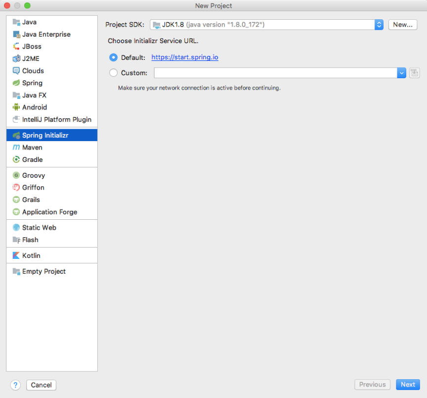
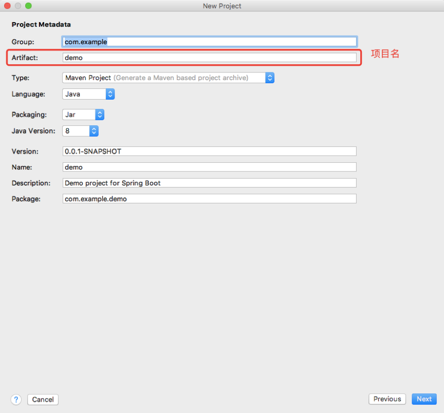
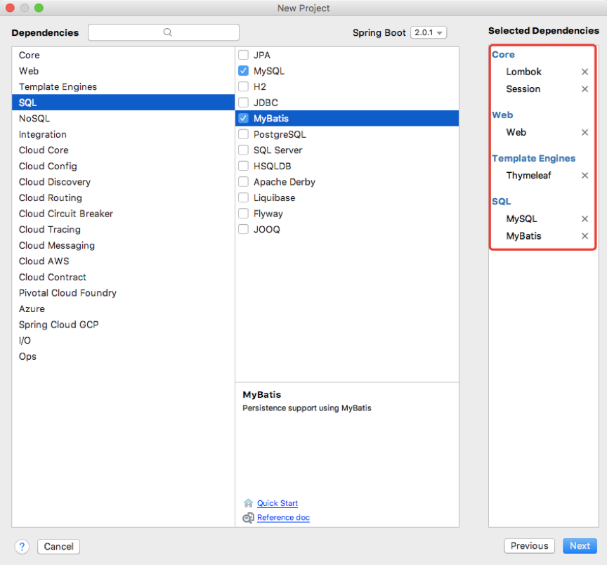
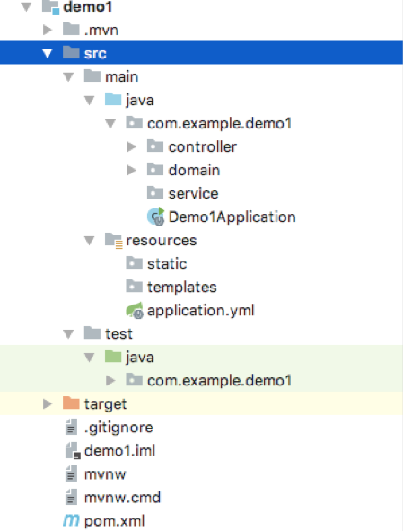
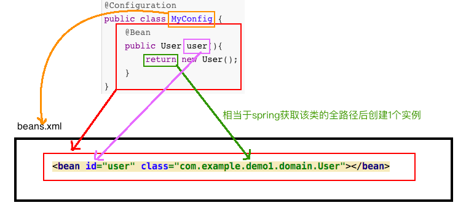
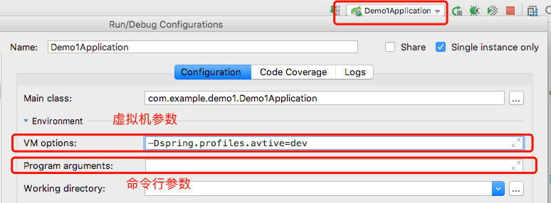
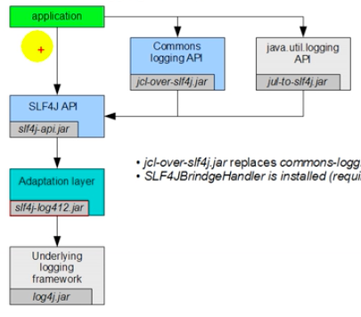
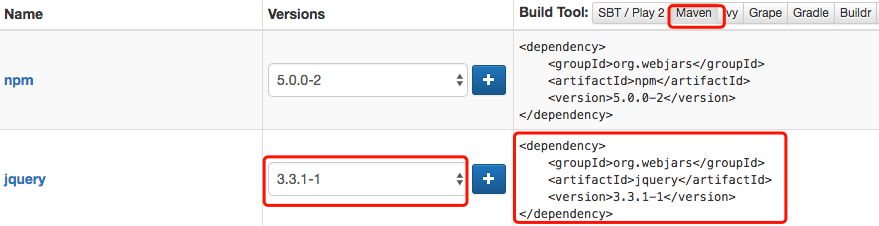
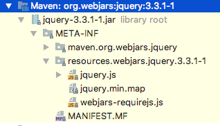

# 一. 搭建环境

## 1. 创建工程

 


 

选择需要的依赖

 

## 2. 目录介绍

 

- src（开发目录）
  - java（代码目录）
    - com.example.demo1
      - Demo1Application.java（自动生成的项目启动类）
  - resources（资源目录）
    - static（用于存放静态资源）
    - templates（用于存放模板文件）
- target（生成的.class文件放在这）
- pom.xml（maven的配置文件，在这里修改项目依赖等项目信息）

# 二. 注解

## 1. 常用注解

### 1.1 @SpringBootApplication

####1.1.1. 介绍

- 标注这个类是1个SpringBoot应用，springboot会找到标注该注解的类的main方法启动应用程序

- @SpringBootApplication是1个组合注解：

  ```java
  @Documented
  @Inherited
  @SpringBootConfiguration
  @EnableAutoConfiguration
  @ComponentScan(excludeFilters = {
  		@Filter(type = FilterType.CUSTOM, classes = TypeExcludeFilter.class),
  		@Filter(type = FilterType.CUSTOM, classes = AutoConfigurationExcludeFilter.class) })
  public @interface SpringBootApplication {
  ```

  - @SpringBootConfiguration

    表示这是1个SpringBoot的配置类

    @SpringBootConfiguration也是1个组合注解：

    - @Configuration

      标注在类上，表示该类是个配置类

      配置类相当于配置文件

      @Configuration也是1个组合注解

      - @Component

        参见[6. @Component](#1.6. @Component) 

  - @EnableAutoConfiguration

    开启自动配置功能

    @EnableAutoConfiguration是1个组合注解

    ```java
    @AutoConfigurationPackage
    @Import(AutoConfigurationImportSelector.class)
    public @interface EnableAutoConfiguration {
    ```

    - @AutoConfigurationPackage

      将主配置类（@SpringBootApplication标注的类）所在的包及其子包下的组件扫描到Spring容器

      扫描的是自己写的组件

    - @Import(AutoConfigurationImportSelector.class)

      导入当前项目所需的组件

      导入的是web项目依赖的组件，如webMVC

### 1.2. @RestController

​	相当于同时使用[@Controller](#1.8. @Controller)+[ @ResponseBody](#1.9. @ResponseBody)

### 1.3. @RequestMapping

- 用于配置路由
- 使用了该注解，方法就可以传入request、response对象了

####1.3.1. 属性

##### value

- 作用：用于配置路由的URL

- 注意：不知定属性值时默认将属性值赋给value

- 可接受值：

  字符串：单个路由的URL   如：”/user”

  字符串数组，多个路由的集合，访问其中任意路由均可访问      如：{“/a”,”/b”}

- 例

  ```java
  @RequestMapping("/getUser")
  //或 @RequestMapping(value = "/getUser")
  public User getUser() {
  User user=new User();
  user.setUserName("小明");
  user.setPassWord("xxxx");
  return user;
  }
  ```

- 用于修饰类时，类中的方法也需要使用该注解修饰，则需要将两个注解的url拼接后才可访问

  ```java
  @RequestMapping("/home")
  public class HelloworldController {
      @RequestMapping(value = "/hello",method = RequestMethod.GET)
      public String getUser() {
          return "hello";
      }
  }
  ```

  此时需要访问localhost:8081/home/hello才能访问

#####  method

- 作用

  指定请求方式

- 例

  ```java
  @RequestMapping(value = "/getUser",method = RequestMethod.GET)
  public User getUser() {
      User user=new User();
      user.setUserName("小明");
      user.setPassWord("xxxx");
      return user;
  }
  ```

###1.4. @Value

- 作用

  用于取出application.yml或application.properties文件中配置的属性，并赋给他下面的变量

  不支持松散语法绑定

- 例

  ```java
  @Value("${cupSize}")
  private String cupSize;
  ```

###1.5. @ConfigurationProperties

####1.5.1. 介绍

- 使用范围

  用于标注javaBean类

- 作用

  将他标注的类中的所有属性与配置文件中的配置进行绑定

  支持松散语法绑定（last-name、last_name、lastName认为是同1个变量）

- 例

  application.yml中的属性

  ```Yaml
  girl:
    cupSize: F
    age: 15
  ```

  bean类

  ```java
  @Component
  @ConfigurationProperties(prefix = "girl")
  public class Girl {
      private String cupSize;
      private Integer age;

      public String getCupSize() {
          return cupSize;
      }
      public void setCupSize(String cupSize) {
          this.cupSize = cupSize;
      }
      public Integer getAge() {
          return age;
      }
     public void setAge(Integer age) {
          this.age = age;
      }
  }
  ```

  定义对象

  ```java
  @Autowired
  private Girl girl;
  ```

####1.5.2. 属性

##### prefix

​	指定前缀进行绑定

#### 注意

​	如果出现如下错误提示

​       		Spring Boot Configration AnnotationProcessor not found in classpath

​	在pom.xml文件中加入如下依赖：

```Xml
<dependency>
    <groupId>org.springframework.boot</groupId>
    <artifactId>spring-boot-configuration-processor</artifactId>
    <optional>true</optional>
</dependency>
```

​	再出现“Re-Run spring boot…”提示不用管

###1.6. @Component

​	表示这是1个组件，使用了该注解的组件会被spring自动扫描并进行管理

###1.7. @Autowired

- 使用范围

  定义1个类的对象时，如果希望对该对象注入1个实例，则使用该注解

- 作用

  向他标注的对象注入1个实例

  这种方式是类型注入

- 例

  ```java
  @Autowired
  private Girl girl;
  ```

  前提是Girl类标注了@Component注解，交给spring管理了，注入才能成功

- @AutoWired注入接口

  参见[@AutoWired注入接口](https://www.jianshu.com/p/3942cce05f71)

###1.8. @Controller

​	表示这个类是控制层的类，用于处理http请求

###1.9. @ResponseBody

- 将方法返回值直接写给浏览器
- 如果是对象还能转为json数据

###1.10. @PathVariable

- 获取动态路由参数

- 例

  ```java
  @RequestMapping(value = "/hello/{id}",method = RequestMethod.GET)
  public Integer getUser(@PathVariable("id")Integer id) {
      return id;
  }
  ```

  访问localhost:8081/hello/100时，id的值就是100

- 注意：该注解只能用于参数列表中

###1.11. @RequestParam

####1.11.1. 介绍

- 作用

  获取任意请求方式的请求参数

- 注意

  该注解只能用于参数列表中

- 例

  ```java
  @RequestMapping(value = "/hello", method = RequestMethod.GET)
  public Integer getUser(@RequestParam(value = "id", 
          required = false, defaultValue = "10") Integer id) {
      return id;
  }
  ```

####1.11.2. 属性

##### required

​	该请求参数是否必传

#####defaultValue

​	请求参数的默认值

###1.12. @GetMapping

- 作用

  用于配置路由，Get表示请求方式

- 例

  ```java
  @GetMapping("/hello")
  //等效于
  @RequestMapping(value = "/hello", method = RequestMethod.GET)
  ```

###1.13. @PostMapping

- 作用

  用于配置post请求方式的路由

- 例

  ```java
  @PostMapping("/hello")
  //等效于
  @RequestMapping(value = "/hello", method = RequestMethod.)
  ```

###1.14. @PropertySource

####1.14.1. 介绍

- 作用

  获取配置文件中属性时，默认从application.properties文件中获取，需要从别的文件中获取时，使用本注解

- 注意

  - 加了该注解，也会先在application.properties文件中找，找不到了再去本注解指定的文件找
  - 本注解只能指定“*.properties”文件，不能指定“ *.yml”文件
  - 本注解用于从==“*.properties”==文件中==获取属性==，与[@ConfigurationProperties](#1.5. @ConfigurationProperties)类似

- 例

  ```java
  @Component
  @PropertySource(value={"classpath:girl.properties"})
  @ConfigurationProperties(prefix = "girl")
  public class Girl {
      private String cupSize;
      private Integer age;
  ```

  其中，`classpath:girl.properties`表示resources目录下的girl.properties文件

####1.14.2. 属性

##### value

- 作用：指定要获取的配置文件
- 值
  - 指定1个时，值可以是字符串
  - 指定多个时，值可以是字符串数组

### 1.15 @ImportResource

#### 1.15.1 介绍

- 作用

  加载spring配置文件

- 用途

  ​	将组件交给spring管理有2种方式：1.@Component注解；2.加载spring配置文件

  ​	使用@Component注解的组件自动被加载到了ApplicationContext对象中，但是在spring配置文件中加载的组件无法自动被加载，所以需要使用本注解指定文件，将该spring配置文件交给Spring管理

- 注意

  本注解用于生效spring配置文件（*.xml）中的配置，类似于spring中的如下代码

  ```java
  ApplicationContext context = new FileSystemXmlApplicationContext
              ("C:/Users/ZARA/workspace/HelloSpring/src/Beans.xml");
  ```

- 例

  ```java
  @ImportResource({"classpath:beans.xml"})
  @SpringBootApplication
  public class Demo1Application {

      public static void main(String[] args) {
          SpringApplication.run(Demo1Application.class, args);
      }
  }
  ```


#### 1.15.2 属性

##### value

- 作用

  指定需要加载的spring配置文件

- 值

  - 指定1个时，值可以是字符串
  - 指定多个时，值可以是字符串数组

### 1.16. @Configuration

- 作用

  用于标注这个是1个配置类

  相当于spring配置文件

- 例

  ```java
  @Configuration
  public class MyConfig {
      @Bean
      public User user(){
          return new User();
      }
  }
  ```

### 1.17. @Bean

- 作用

  用于在配置类中配置1个bean

  相当于spring配置文件中的bean标签

- 与sprig配置文件对比

  - 方法名相当于Bean标签的id

  - 返回值添加到spring容器

    相当于spring从spring配置文件中获取到类的全路径后创建1个实例添加到容器

- 例

  ```java
  @Configuration
  public class MyConfig {
      @Bean
      public User user(){
          return new User();
      }
  }
  ```

  


## 2.知识点


### 2.1. 配置类

- 介绍

  配置类是使用了@Configuration和@Bean注解的特殊的类，他的出现时用来替代原来的spring配置文件

- 配置类与spring配置文件对应关系

   

  

  


# 三. 项目属性配置

##1. 配置文件

###1.1. 全局配置文件

​	默认情况下resources目录下的application.properties文件就是项目属性的配置文件，配置方法如下

​	                               

​	springboot也支持“application.yml”文件，配置方法如下：

​	

### 1.2. yml语法

#### 1.2.1. 基本语法

- Key:(空格)value：表示一对键值对（空格必须有）

- 以空格缩进表示层级关系

  ```yaml
  girl: 
    cupSize: F
    age: 15
  ```

- key和value都是大小写敏感的

#### 1.2.2. 值的写法

- 字面量

  数字、字符串、布尔等

  ```yaml
  key: value
  ```

- 对象

  使用层级关系

  ```yaml
  key: 
  	key0: value0
  	key1: value1
  ```

  或行内写法：

  ```yaml
  key: {key0: value0,key1: value1}
  ```

- 数组

  使用“-”表示数组内元素

  ```yaml
  key: 
  	- value0
  	- value1
  ```

  或行内写法

  ```yaml
  key: [value0,value1]
  ```

#### 1.2.3. 引号

- 双引号

  双引号可以转义字符串中的特殊字符

  如：“a \n b”中\n会被当做换行处理

- 单引号

  单引号不会转义字符串中的特殊字符

  如：‘a \n b’中的\n只会被当做普通字符串处理

#### 1.2.4. 文档块

​	yml中可以在同1个yml文件中使用`---`将文件分割为多个文档块，各文档快之间相当于是两个yml文件

```yaml
person: 
	name: shuyan
	age: 25
---
person: 
	name: shuyan
	age: 25
```


### 1.3. Profile

- 有时需要根据生产环境和开发环境加载不同的配置文件，可以按`application-(profile).properties/xml`的方式创建不同的全局配置文件，然后在默认的`application.properties`中指定profile选择配置文件；如：
  - 分别创建application-dev.yml和application-prod.yml文件

     

- 指定profile选择配置的方式

  - 在application.yml中配置如下属性切换配置文件

  ```yaml
  spring:
    profiles:
      active: dev
  ```

  - 命令行

    将springboot工程打成jar包后，可以在命令行启动应用程序，后面跟上`--spring.profile.active=dev`

    ```
    java -jar test.jar --spring.profiles.active=dev
    ```

  - 虚拟机参数

    在下图位置设置虚拟机参数`-Dspring.profiles.active=dev`

     

### 1.4. 配置文件加载位置及顺序

- springboot启动后会从如下位置依次匹配`application.properties`或`application.yml`文件作为默认配置文件

  > -file:./config/			(项目根目录下的config目录)
  >
  > -file:./				（项目根目录下，就是pom.xml所在目录）
  >
  > -classpath:./config/	（resources下的config目录）
  >
  > -calsspath:./			（resources目录）

  - 优先级从高到底排序，如果有两个相同的配置，后扫描到的优先级第，所以后扫描到的会被忽略，生效的是先扫描到的配置
  - springboot会将上面位置中的`application.properties/yml`文件都扫描到，进行**互补配置**

- 项目打包好后，可以在命令行中指定`--spring.config.location=D:/app.properties`参数来指定配置文件位置

  - 指定的配置文件和默认加载的配置文件进行**互补配置**

### 1.5. 可配置属性

​	参见[官方文档](https://docs.spring.io/spring-boot/docs/current/reference/htmlsingle/#common-application-properties)

## 2. 属性

### 2.1 自定义属性

- 直接写属性

  ```yaml
  cupSize: F
  ```

  使用@[Value](#Value)获取属性值

- 自定义属性中使用其他属性

  ```yaml
  cupSize: F
  age: 15
  girl: "cupSize:${cupSize},age:${age}"
  ```

  使用@[Value](#Value)获取属性值

- 定义一类属性

  ```yaml
  girl: 
    cupSize: F
    age: 15
  ```

  此时cupSize和age两个属性都属于girl

  使用[5. @ConfigurationProperties](#5. @ConfigurationProperties)和[7. @AutoWired](#7. @Autowired)获取属性值

### 2.2 内置属性

#### server

##### port

- 作用：配置当前项目端口号

- 

  ```yaml
  server:
    port: 8081
  ```

#### spring

##### profiles

- 指定当前文档块的profiles属性，多用于yml文件的某个文档块中

- 例

  ```yaml
  server:
  	port: 8081
  spring:
  	profiles:
  		active: dev
  ---
  server:
  	port: 8082
  spring:
  	profiles:dev
  ---
  server:
  	port: 8083
  spring:
  	profiles: prod
  ```

  

###### active

​	用于切换配置文件，参见[切换配置文件](#切换配置文件) 

##### resources

###### static-location

​	用于指定新的静态资源路径（替换掉默认的），值可以是逗号分隔的多个路径

# 四. 日志

​	本章日志框架采用SLF4J+logback

## 1. 日志框架原理

​	 

- application

  我们的应用程序

- SLF4J API

  这是1个日志抽象层，是为了后续对实现类进行升级时，避免因为依赖导致的问题

- Adaptation layer

  ​	这是1个适配层，由于最开始开发log4j时没有做抽象层，后开发的抽象层没办法兼容log4j，所以引入适配层来专门适配log4j

- Underlying logging framework

  真正的日志实现层

- 右边的2层

  ​	由于在开发中，搭配使用的其他框架底层使用的可能是其他日志框架，所以这里需要先排除掉原有的日志框架，替换为SLF4J针对每种日志做的1个中间包，这样最终就都使用SLF4J日志框架了

## 2. 替换其他框架中的日志框架

​	springboot默认使用的就是logback，所以很多事已经替我们做了，我们只需要引入框架时将原有日志框架移除掉即可，类似于如下配置：

```xml
<dependency>
   <groupId>org.springframework.boot</groupId>
   <artifactId>spring-boot-starter-web</artifactId>
   <!-- 排除自带的日志框架 -->
   <exclusions>
       <exclusion>
           <groupId>org.springframework.boot</groupId>
           <artifactId>spring-boot-starter-logging</artifactId>
       </exclusion>
   </exclusions>
</dependency>
```

## 3. 日志使用

### 3.1日志级别

​	日志使用方式如下：

```java
@RestController
public class HelloworldController {
    Logger logger = LoggerFactory.getLogger(getClass());

    public String getUser() {
        
        logger.trace("trace");  //跟踪信息
        logger.debug("debug");  //调试信息
        logger.info("info");    //自定义信息
        logger.warn("warn");    //警告信息
        logger.error("error");  //错误信息
        
        return "1";
    }
}
```

- 默认分为5个级别的打印（由低到高排序）：

  trace < debug < info < warn < error

- 设置日志等级

  将日志等级设置到某个级别后，将只打印该级别和比他高的级别的打印信息

  默认日志等级为info

- 配置日志级别

  在`application.properties`文件中按如下配置：

  ```Properties
  logging.level.com.shuyan = trace
  ```

  其中：`com.shuyan`为要配置哪个包下的类的日志级别

### 3.2. 日志配置属性

#### logging.level

​	参见[日志级别](#3.1日志级别)

#### logging.path & logging.file	

| Logging.file | logging.path | 描述                                                         |
| :----------: | :----------: | :----------------------------------------------------------- |
|   （none）   |   （none）   | 默认只在控制台输出                                           |
|   （none）   |     /log     | 输出到当前所在磁盘下的log文件夹下砸sring.log文件             |
|    My.log    |   （none）   | logging.file 的值带路径时输出到指定的位置及文件<br/>logging.file的值没有带路径时输出到当前项目根路径下指定的文件中 |
|              |              | 这两个属性一般不一起使用                                     |

# 五. web

## 1. 静态资源映射

​	静态资源分为两种：

- webjars（前端框架，如jquery等）
- 静态资源（自己写的前段页面等）

### 1.1. webjars

- 引入webjars静态资源

  ​	在http://www.webjars.org/中扎到需要引入的资源，按如下方式找到依赖并复制下来，粘贴到pom.xml文件中

   

  ​	引入资源后，在External Libaries找那个找到jquery的jar包目录：

  ​	 

- 资源映射

  ​	springboot将所有`/webjars/**`的访问均映射到webjars的jar包下的`classpath:/META-INFO/resources/webjars/`目录下

  ​	所以现在访问`localhost:8081/webjars/jquery/3.3.1-1/jquery.js`即可访问到上图中的`jquery.js`文件

  ​	js、css、html中也可以使用`/webjars/jquery/3.3.1-1/jquery.js`使用框架中的文件

### 1.2. 静态资源

- 静态资源映射

		`/**`请求映射到如下目录

>"classpath:/META-INF/resources/", 
>"classpath:/resources/",
>"classpath:/static/", 
>"classpath:/public/" 
>"/"

​	注：classpath指的是`/src/main/resources/`,`/`指的是工程根目录

- `**/favicon.ico`请求映射到上述目录下寻找
- `spring.resources.static-location`属性可以配置静态资源路径，替换掉默认的

## 2. 模板引擎thymeleaf

### 2.1. 引入thymeleaf

```xml
<dependency>
    <groupId>org.springframework.boot</groupId>
    <artifactId>spring-boot-starter-thymeleaf</artifactId>
</dependency>
```

### 2.2. 如何渲染模板

- 使用

  - 将html模板页面放在`classpath:/temppates/`下，或放在该目录下的其他子目录下
  - 将路由函数的返回值设置为要渲染的模板相对于`classpath:/temppates/`的相对路径

- 例

  - 将模板`success.html`放在`classpath:/templates/1/`目录下

  - 请求`localhost:8081/success`时，返回该模板的相对路径

    ```java
    @GetMapping("/success")
    public String testThymeleaf(){
        return "1/success";
    }
    ```

- 向模板传递数据

  ```java
  @GetMapping("/success")
  //通过该方法参数传进来的对象相当于request域
  public String testThymeleaf(Map<String, Object> map){
      //向request域中设置属性
      map.put("name","shuyan");
      //渲染页面
      return "1/success";
  }
  ```

  页面上就可以通过thymeleaf语法拿到request域中的数据了

### 2.3. thymeleaf语法

​	完整语法参见[Thymeleaf官方API](https://www.thymeleaf.org/documentation.html)中的PDF文档

#### 2.3.1. 导入命名空间

​	在html模板页面的html标签上添加属性，变成如下样子：

```html
<html lang="en" xmlns:th="http://www.thymeleaf.org"></html>
```

​	此时在页面上使用thymeleaf就可以有代码提示了

#### 2.3.2. 语法介绍

- 原有html标签上的每个属性，thymeleaf都提供了1个对应的`th:xxx`属性

  如：

  ```html
  <div id="id1" th:id="${name}">
  </div>
  ```

- 当同时设置了原有属性与对应的th属性后，若th属性为null，则使用原有属性；若th属性不为null，则使用th属性替代原有属性

- th属性的值，可以使用`"${属性名}"`的形式获取域中的值

#### 2.3.3. 语法

- th属性

   

- 表达式

  ```properties
  Simple expressions:（表达式语法）
      Variable Expressions: ${...}：获取变量值；OGNL；
      		1）、获取对象的属性、调用方法
      		2）、使用内置的基本对象：
      			#ctx : the context object.
      			#vars: the context variables.
                  #locale : the context locale.
                  #request : (only in Web Contexts) the HttpServletRequest object.
                  #response : (only in Web Contexts) the HttpServletResponse object.
                  #session : (only in Web Contexts) the HttpSession object.
                  #servletContext : (only in Web Contexts) the ServletContext object.
                  
                  ${session.foo}
              3）、内置的一些工具对象：
  #execInfo : information about the template being processed.
  #messages : methods for obtaining externalized messages inside variables expressions, in the same way as they would be obtained using #{…} syntax.
  #uris : methods for escaping parts of URLs/URIs
  #conversions : methods for executing the configured conversion service (if any).
  #dates : methods for java.util.Date objects: formatting, component extraction, etc.
  #calendars : analogous to #dates , but for java.util.Calendar objects.
  #numbers : methods for formatting numeric objects.
  #strings : methods for String objects: contains, startsWith, prepending/appending, etc.
  #objects : methods for objects in general.
  #bools : methods for boolean evaluation.
  #arrays : methods for arrays.
  #lists : methods for lists.
  #sets : methods for sets.
  #maps : methods for maps.
  #aggregates : methods for creating aggregates on arrays or collections.
  #ids : methods for dealing with id attributes that might be repeated (for example, as a result of an iteration).

      Selection Variable Expressions: *{...}：选择表达式：和${}在功能上是一样；
      	补充：配合 th:object="${session.user}：
     <div th:object="${session.user}">
      <p>Name: <span th:text="*{firstName}">Sebastian</span>.</p>
      <p>Surname: <span th:text="*{lastName}">Pepper</span>.</p>
      <p>Nationality: <span th:text="*{nationality}">Saturn</span>.</p>
      </div>
      
      Message Expressions: #{...}：获取国际化内容
      Link URL Expressions: @{...}：定义URL；
      		@{/order/process(execId=${execId},execType='FAST')}
      Fragment Expressions: ~{...}：片段引用表达式
      		<div th:insert="~{commons :: main}">...</div>
      		
  Literals（字面量）
        Text literals: 'one text' , 'Another one!' ,…
        Number literals: 0 , 34 , 3.0 , 12.3 ,…
        Boolean literals: true , false
        Null literal: null
        Literal tokens: one , sometext , main ,…
  Text operations:（文本操作）
      String concatenation: +
      Literal substitutions: |The name is ${name}|
  Arithmetic operations:（数学运算）
      Binary operators: + , - , * , / , %
      Minus sign (unary operator): -
  Boolean operations:（布尔运算）
      Binary operators: and , or
      Boolean negation (unary operator): ! , not
  Comparisons and equality:（比较运算）
      Comparators: > , < , >= , <= ( gt , lt , ge , le )
      Equality operators: == , != ( eq , ne )
  Conditional operators:条件运算（三元运算符）
      If-then: (if) ? (then)
      If-then-else: (if) ? (then) : (else)
      Default: (value) ?: (defaultvalue)
  Special tokens:
      No-Operation: _ 
  ```

## 3. SpringMVC

- SpringBoot对SpringMVC进行了自动配置，加载了一些最基本的视图控制器（url映射到模板）、拦截器等，如果用户需要添加一些自己的功能，可以通过如下方法进行扩展：

- 编写1个配置类，实现`WebMvcConfigurer`接口，加上`@Configuration`注解，通过重写接口中的方法进行功能扩展

- 如：

  ```java
  @Configuration
  public class MyMvcConfig implements WebMvcConfigurer {
      @Override
      public void addViewControllers(ViewControllerRegistry registry) {
          /*
           * mvctest:请求路径
           * 1/success：映射到的模板，指向classpath：/templates/1/success.html
           */
          registry.addViewController("/mvctest").setViewName("1/success");
      }
  }
  ```

- 注意

  ​	扩展springMVC功能时，==不能==使用@EnableWebMvc注解，该注解表示全面托管springMVC的功能

  ```java
  @Configuration
  @EnableWebMvc
  public class MyMvcConfig implements WebMvcConfigurer {
  ```

  

	​	