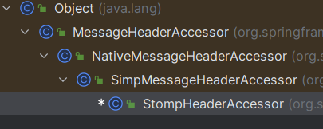

# STOMP

## 路由前缀

+ `/app`开头的路径会交给`@MessageMapping`或`@SubscribeMapping`标注的方法处理
+ `/topic`或`/queue`开头的路径会交给STOMP代理处理
+ `/user`开头的路径会交给用户独有的处理方法

## 消息对象

+ 方法接收消息，或者需要将返回值转发到其他地方时有两种参数使用形式：
  + 直接使用类型接收（如String）
  + 使用`org.springframework.messaging.Message`类接收，会包含头信息

## 接收消息

+ 这两个注解必须在`@RestController`注解标注的接口类中才能有效

### @MessageMapping

+ 示例

  ```java
  @MessageMapping("/msg")
  public String messageMapping(String message) {
      log.info("messageMapping:{}",message);
      return "receive: " + message;
  }
  ```

+ `@MessageMapping` 指定目的地是`/app/msg`

+ 返回值不是返回给客户端，而是转发给消息代理，默认是原来的目的地址加上`/topic`前缀，上例中转发到`/topic/msg`

+ 客户端每次向该目的地发送消息时触发

### @SubscribeMapping

+ 示例

  ```java
  @SubscribeMapping("/msg")
  public String subscribeMapping() {
      log.info("subscribeMappingSendTo");
      return "received";
  }
  ```

+ `@SubscribeMapping`指定目的地是`/app/msg`

+ 返回值返回给客户端，不过是异步的

+ 客户端订阅这个目的地时触发一次

### 消息参数

+ @Payload

  + 用于接收消息体

  + 该注解是可以被省略的，处了7可以被识别的类以外，会自动加上该注解

  + 示例

    ```java
    @MessageMapping("/msg-to")
    // public String messageMappingSendTo(@Payload String message) {
    public String messageMappingSendTo(String message) {
        log.info("messageMappingSendTo:{}",message);
        return "receive: " + message;
    }
    ```

+ Message

  + 用于接受完整消息

  + 示例

    ```java
    @MessageMapping("/msg-send-user-void")
    public void messageMappingSendUserVoid(Message<String> message) {
        log.info("messageMappingSendUserVoid:{}",message);
        simpMessagingTemplate.convertAndSendToUser("123","/topic/chat",message);
    }
    ```

+ MessageHeaders

  + 用于接收请求头

  + 示例

    ```java
    @MessageMapping("/msg")
    public void messageMapping(MessageHeaders headers) {
        log.info("headers:{}",headers);
    }
    ```

+ StompHeaderAccessor

  + 用于操作消息头部信息的处理类

  + 也可以使用`SimpMessageHeaderAccessor`或`MessageHeaderAccessor`

    + `StompHeaderAccessor`专门用于处理`stomp`消息
    + `SimpMessageHeaderAccessor`用于处理Spring 框架内部的消息传递，无关协议
    + `MessageHeaderAccessor`是一个通用的消息头部访问器，无关协议

  + 这三者关系

     

  + 示例

    ```java
    @MessageMapping("/msg")
    public void messageMapping(StompHeaderAccessor accessor) {
        log.info("user:{}",accessor.getUser());
    }
    ```

+ @Header

  + 用户获取指定请求头

  + 例

    ```java
    @MessageMapping("/msg")
    public void messageMapping(@Header String stompCommand) {
        log.info("stompCommand:{}",stompCommand);
    }
    ```

+ @Headers

  + 用户获取所有请求头

  + 必须使用`Map`集合接受

  + 例

    ```java
    @MessageMapping("/msg")
    public void messageMapping(@Headers Map<String, String> headers) {
        log.info("headers:{}",headers);
    }
    ```

+ @DestinationVariable

  + 类似于@PathVariable

  + 例

    ```java
    @MessageMapping("/msg/{id}")
    public void messageMapping(@DestinationVariable String id) {
        log.info("id:{}",id);
    }
    ```

+ java.security.Principal

  + 用于接收握手阶段绑定的身份信息

  + 例

    ```java
    @MessageMapping("/msg")
    public void messageMapping(Principal principal) {
        log.info("principal:{}",principal);
    }
    ```

## 发送消息

### @SendTo

+ 示例

  ```java
  @MessageMapping("/msg-to")
  @SendTo("/topic/to")
  public String messageMappingSendTo(String message) {
      log.info("messageMappingSendTo:{}",message);
      return "receive: " + message;
  }
  ```

+ 重写目的地址，将返回值转发给消息代理，地址是指定的地址，必须使用`/topic`开头

+ 相当于`convertAndSend`，属于广播模式

### @SendToUser

+ 示例

  ```java
  @MessageMapping("/msg-to-user")
  @SendToUser("/topic/chat")
  public String messageMappingSendToUser(String message) {
      log.info("messageMappingSendToUser:{}",message);
      return "receive: " + message;
  }
  ```

+ 将返回消息转发给当前会话用户，不能发给其他用户

+ 使用该注解必须鉴权

+ `@SendToUser`注解参数必须以`topic`开头，前端订阅用户消息时，订阅地址是`/user/topic/chat`

### convertAndSend

+ 调用`SimpMessageSendingOperations`或者`SimpMessagingTemplate`的`convertAndSend`用于发送消息

+ 属于广播模式

+ 示例

  ```java
  @MessageMapping("/msg-send")
  public String messageMappingSend(Message<String> message) {
      log.info("messageMappingSend:{}",message);
      simpMessagingTemplate.convertAndSend("/topic/to",message);
      return "receive: " + message;
  }
  ```

+ 因为有返回值，所以在`/topic/to`和`/topic/msg-send`两个目的地都可以监听到消息

### convertAndSendToUser

+ 调用`SimpMessageSendingOperations`或者`SimpMessagingTemplate`的`convertAndSendToUser`用于给用户发送消息

+ 示例

  ```java
  @MessageMapping("/msg-send-user-void")
  public void messageMappingSendUserVoid(Message<String> message) {
      log.info("messageMappingSendUserVoid:{}",message);
      simpMessagingTemplate.convertAndSendToUser("123","/topic/chat",message);
  }
  ```

+ 建立连接时需要鉴权

+ 前端监听`/user/topic/chat`即可监听到消息

## 异常处理

+ MessageExceptionHandler

  + 示例

    ```java
    @MessageExceptionHandler(Exception.class)
    @SendTo("/topic/exception")
    public Exception handleExceptions(Exception t){
        t.printStackTrace();
        return t;
    }
    ```

  + 用于处理`stomp`在处理消息过程中抛出的异常

## 鉴权

### 身份认证

+ 实现拦截器在发送之前绑定用户信息

  ```java
  @Configuration
  @EnableWebSocketMessageBroker
  public class StompWebSocketConfig implements WebSocketMessageBrokerConfigurer {
  
      @Override
      public void configureClientInboundChannel(ChannelRegistration registration) {
          registration.interceptors(new StompChannelInterceptor());
      }
  }
  
  @Slf4j
  public class StompChannelInterceptor implements ChannelInterceptor {
  
      @Override
      public Message<?> preSend(@NonNull Message<?> message, @NonNull MessageChannel messageChannel) {
          StompHeaderAccessor accessor = MessageHeaderAccessor.getAccessor(message, StompHeaderAccessor.class);
          /*
           * 1. 判断是否为首次连接请求，如果已经连接过，直接返回message
           * 2. 网上有种写法是在这里封装认证用户的信息，本文是在http阶段，websockt 之前就做了认证的封装，所以这里直接取的信息
           */
          assert accessor != null;
          if (StompCommand.CONNECT.equals(accessor.getCommand())) {
              // 这里可以做登录验证逻辑，除了getLogin()可以getPasscode()拿到密码做登录验证。
              Principal user = accessor::getLogin;
              // 设置用户
              accessor.setUser(user);
              log.info("用户:" + user + " 建立连接");
          } else if (StompCommand.DISCONNECT.equals(accessor.getCommand())) {
              log.info("用户:" + accessor.getUser() + " 断开连接");
          }
          return message;
      }
  }
  ```

+ [使用security鉴权](http://golang.0voice.com/?id=4810) 

### 权限控制

可以在拦截器中在不同的事件中根据用户身份自己实现权限控制逻辑

以下是抄过来的代码

```java
public Message<?> preSend(Message<?> message, MessageChannel channel) {
    // 获取连接头信息
    StompHeaderAccessor accessor =
        MessageHeaderAccessor.getAccessor(message, StompHeaderAccessor.class);

    // 连接验证token合法性(简单模拟)
    if (StompCommand.CONNECT.equals(accessor.getCommand())) {
        // 获取头中的token
        String token = accessor.getFirstNativeHeader("token");
        if (StringUtils.hasText(token)) {
            String redisToken = redisTemplate.opsForValue().get(SOCKET_TOKEN_PREFIX);
            if (token.equals(redisToken)) {
                /* 这里可以结合 Security
                    UsernamePasswordAuthenticationToken authentication = new UsernamePasswordAuthenticationToken(userDetails, null, userDetails.getAuthorities());
                   SecurityContextHolder.getContext().setAuthentication(authentication);
                    accessor.setUser(authentication);
*/
                // 简单处理设置对应权限。完整的应该根据用户的权限得出是否有发送/订阅到某个目的路径的权限
                accessor.setUser(new UserPrincipal() {
                    @Override
                    public String getName() {
                        // 模拟权限类，仅有属性可发送/订阅
                        Permission permission = new Permission();
                        permission.setIsSend(true);
                        permission.setIsSubscribe(true);
                        String s = JSON.toJSONString(permission);
                        return s;
                    }
                });

            } else {
                throw new IllegalAccessException("未授权！！！");
            }
        } else {
            throw new IllegalAccessException("未授权！！！");
        }
        // 订阅权限认证
    } else if (StompCommand.SUBSCRIBE.equals(accessor.getCommand())) {
        UserPrincipal user = ((UserPrincipal) accessor.getUser());
        String value = user.getName();
        if (StringUtils.hasText(value)) {
            JSONObject jsonObject = JSONObject.parseObject(value);
            Boolean flag = ((Boolean) jsonObject.get("isSubscribe"));
            if (!flag) {
                throw new IllegalAccessException("无权限订阅！！！");
            }
        } else {
            throw new IllegalAccessException("无权限订阅！！！");
        }
        // 发送权限验证
    } else if (StompCommand.SEND.equals(accessor.getCommand())) {
        UserPrincipal user = ((UserPrincipal) accessor.getUser());
        String value = user.getName();
        if (StringUtils.hasText(value)) {
            JSONObject jsonObject = JSONObject.parseObject(value);
            Boolean flag = ((Boolean) jsonObject.get("isSend"));
            if (!flag) {
                throw new IllegalAccessException("无权限发送！！！");
            }
        } else {
            throw new IllegalAccessException("无权限发送！！！");
        }
    }
    return message;
}
```

## 心跳

+ 默认是没有心跳的，想开启心跳，进行如下配置

  ```java
  @Configuration
  @EnableWebSocketMessageBroker
  public class StompWebSocketConfig implements WebSocketMessageBrokerConfigurer {
  
      @Override
      public void configureMessageBroker(MessageBrokerRegistry registry) {
          // 自定义调度器，用于控制心跳线程
          ThreadPoolTaskScheduler taskScheduler = new ThreadPoolTaskScheduler();
          // 线程池线程数，心跳连接开线程
          taskScheduler.setPoolSize(1);
          // 线程名前缀
          taskScheduler.setThreadNamePrefix("websocket-heartbeat-thread-");
          // 初始化
          taskScheduler.initialize();
          // 客户端接收服务器消息的地址前缀
          registry.enableSimpleBroker("/topic").setHeartbeatValue(new long[]{10000, 10000})
                  .setTaskScheduler(taskScheduler);
          // 客户端接收服务器消息的地址前缀
          // registry.enableSimpleBroker("/topic");
          registry.setApplicationDestinationPrefixes("/app");
          // 指定用户发送（一对一）的前缀 /user/  ,不设置的话，默认也是/user/
          registry.setUserDestinationPrefix("/user/");
      }
  }
  ```

  重点在16行，心跳和`taskScheduler`必须同时配置

## 其他配置

### 事件订阅

有2种实现方式

+ 在拦截器中判断`accessor.getCommand()`的值区分事件来实现，参见demo
+ 通过`@EventListener`订阅事件，如`SessionConnectEvent`和`SessionDisconnectEvent `

### 其他

+ 以下配置参见示例代码

  + 输入通道、输出通道线程池

  + 缓存区大小

    